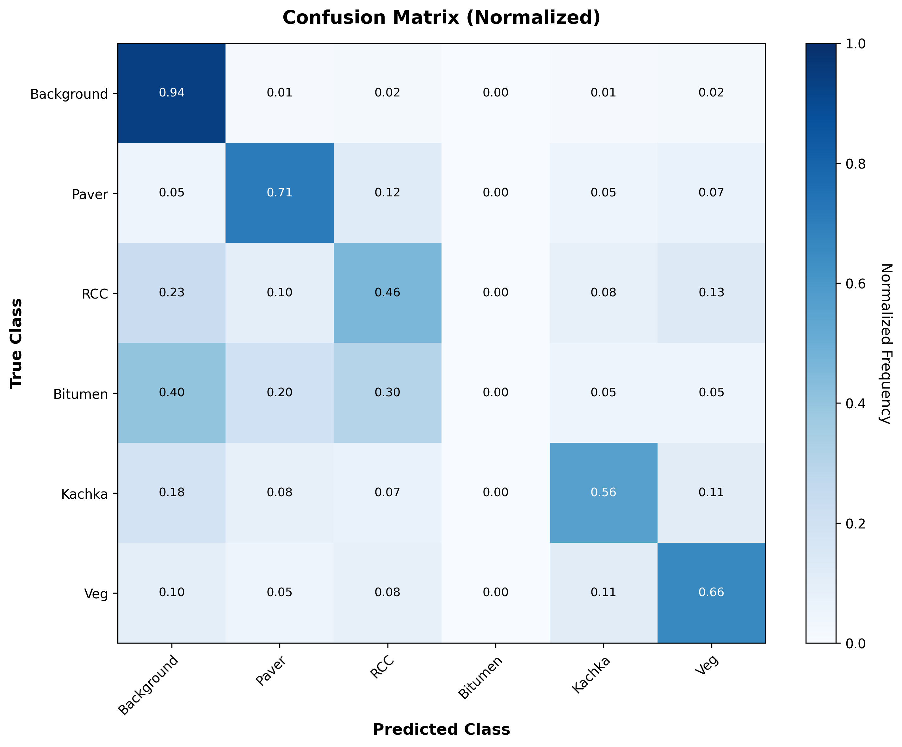

# 🛣️ Automated Road Surface Classification from UAV Imagery

> Vision Transformer-based road surface segmentation using drone imagery

[](https://colab.research.google.com/github/YOUR_USERNAME/road-surface-classification/blob/main/notebooks/Road_Classification.ipynb)

---

## 📋 Overview

Automated road surface classification system using **SegFormer (Vision Transformer)** on UAV imagery.

**Published at:** ICAICS 2026 Conference (March 2026)

### Problem
- Manual road inspection: 2-3 months, ₹5-10 lakh for 500km
- Subjective, dangerous, infrequent

### Solution
- Drone imagery + AI classification
- 90% cost savings, 10× faster
- Objective measurements

---

## 🎯 Key Results

| Model | mIoU | Performance |
|-------|------|-------------|
| **SegFormer-B3** | **42.6%** | ✅ Baseline |
| DeepLabV3+ | 15.9% | 2.7× worse |
| U-Net | 13.7% | 3.1× worse |

**SegFormer outperforms CNNs by 2.7× under identical conditions**

---

## 🚀 Quick Start

### Open in Google Colab

Click the badge above to run the notebook directly in Colab (no setup needed!)

### Run Locally

```bash
# Clone repository
git clone https://github.com/YOUR_USERNAME/road-surface-classification.git

# Install dependencies
pip install -r requirements.txt

# Open Jupyter
jupyter notebook notebooks/Road_Classification.ipynb
```

---

## 📊 Results

### Training Progress


### Confusion Matrix


### Sample Predictions


---

## 🏗️ Methodology

### Dataset
- **Platform**: DJI Phantom 4 Pro
- **Images**: 357 captured, 17 annotated
- **Classes**: 6 (Background, Paver, RCC, Bitumen, Kachha, Vegetation)
- **Altitude**: 80-100m, GSD: ~1.26 cm/pixel

### Model
- **Architecture**: SegFormer-B3 (Vision Transformer)
- **Transfer Learning**: Pre-trained on ADE20K (20K images)
- **Training**: 100 epochs, 7.5 hours on Tesla T4
- **Augmentation**: 8× data expansion

### Key Features
- ✅ Pixel-wise segmentation (384×384 input)
- ✅ Quantitative measurements (area in m²)
- ✅ GIS integration (GeoJSON export)
- ✅ Class-weighted loss for imbalance

---

## 📦 Dependencies

```txt
torch>=1.12.0
transformers>=4.25.0
albumentations>=1.3.0
opencv-python>=4.5.0
matplotlib>=3.5.0
```

See `requirements.txt` for full list.

---

## 📖 Citation

```bibtex
@inproceedings{vyas2026road,
  title={Automated Road Surface Classification from UAV Imagery using Vision Transformers},
  author={Vyas, Het and Thakor, Vishvajit},
  booktitle={ICAICS 2026},
  year={2026}
}
```

---

## 👨‍💻 Author

**Het Vyas**  
BTech Computer Science & Engineering  
Indrashil University, Gujarat

📧 Email: het.vyas@indrashil.edu  
🎓 Guide: Dr. Vishvajit Thakor

---

## 📄 License

MIT License - see [LICENSE](LICENSE) file

---

## 🙏 Acknowledgments

- Dr. Vishvajit Thakor (Project Guide)
- SegFormer by Xie et al. (2021)
- Google Colab for GPU resources

---

**Built with ❤️ for better infrastructure**